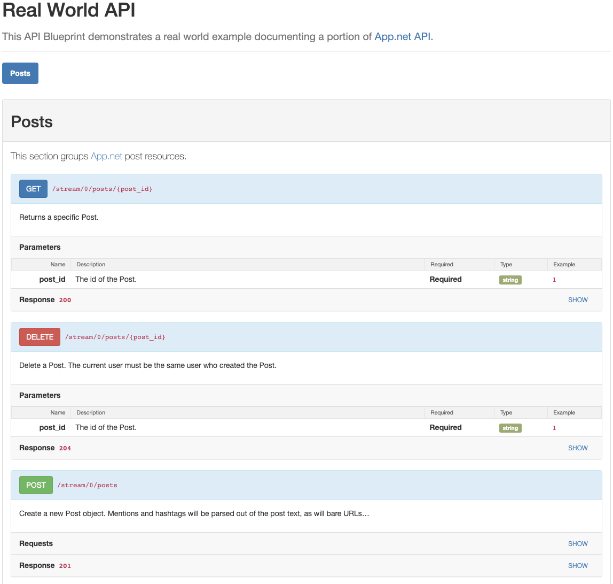

# aglio-theme-hiro

It's a clone of a nice minimalistic theme that was used in [Hiro generator](https://github.com/peterhellberg/hiro).

## Quick start

Install Aglio: 

`npm install -g aglio`

Install Hiro theme:

`npm install -g aglio-theme-hiro`

Then generate your API documentation using Hiro theme:

`aglio -t hiro -i blueprint.apib -o documentation.html`